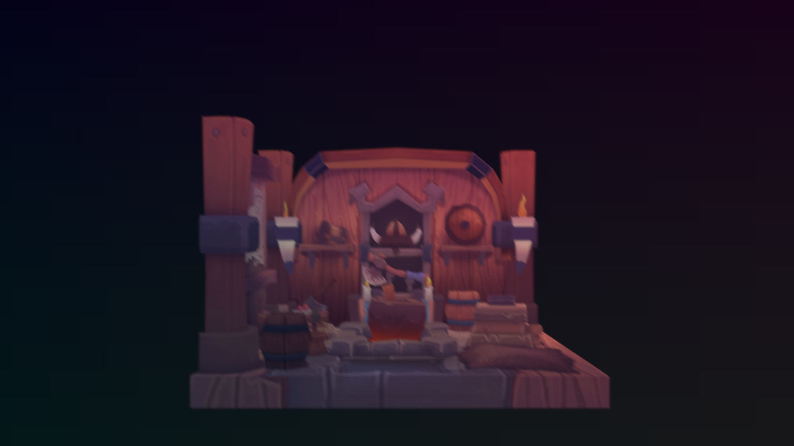
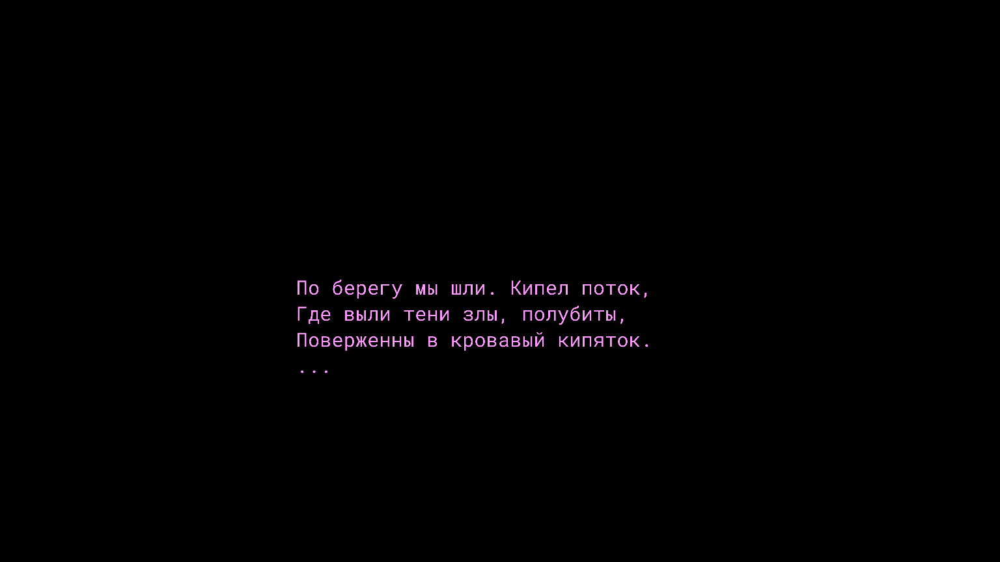
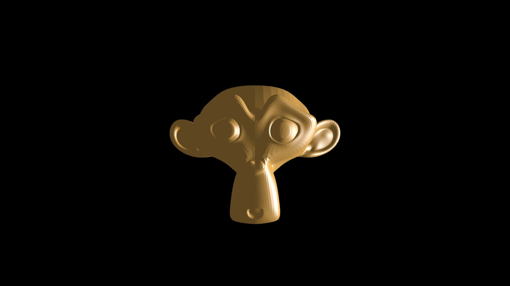

# Eldr
A small Vulkan Rendering Engine

> [!WARNING]
> **Development Status**   
> **Eldr is currently under active development** and is not recommended for production use. The API may change significantly between versions.
> 
> **Platform Support Note:** Currently only Linux is supported. Windows support is planned for future releases.

##  Key Features

### Pipeline Hot Reloading
Real-time shader and pipeline recompilation during runtime
```odin
    if (eldr.is_key_pressed(.R)) {
        gfx.hot_reload_shaders()
    }
```

### Material Code Generation
Automatic material system generation from material structures. A key advantage of this approach is type-safe material interfaces. The generator also automatically adds padding for std140 alignment.

Example:
```odin
package main

import "eldr"
import gfx "eldr/graphics"

@(material)
My_Material :: struct {
    color:   eldr.vec4,
    vector:  eldr.vec3,
    texture: gfx.Texture_Handle,
}
```

After defining your material struct, run:
```bash
$ make gen
```
This generates two files:
1. An Odin source file in your project package.
2. A shader header file at ``assets/shader/gen_types.h``.

The generator creates type-safe getters and setters for each field:
```odin
    material: gfx.Material

    init_mtrl_my(&material, pipeline_h)

    mtrl_my_set_color(&material, {0.5, 1, 0, 1})
    mtrl_my_set_texture(&material, texture_h)
    mtrl_my_set_vector(&material, {1, 1, 1})

    my_texture := mtrl_my_get_texture(material)
    my_color := mtrl_my_get_color(material)
    my_vector := mtrl_my_get_vector(material)
```


### Bindless Rendering
Modern bindless resource management

### Archetype ECS
In development

## Vulkan Features
- Dynamic Rendering
- Descriptor Indexing
- Synchronization 2

## Getting Started

```bash
# Clone the repository
git clone https://github.com/yourusername/eldr.git
cd eldr

make gen-eldr
make gen
make run
```




